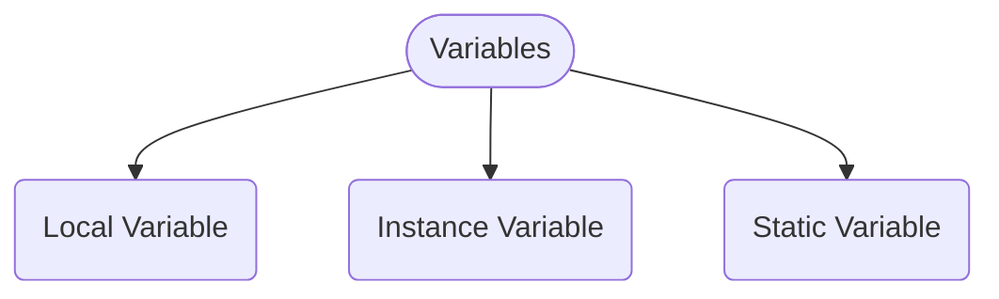
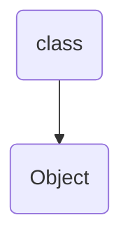

# <p style="text-align:center;color:purple">Types of Variables in Java</p>
- Variable is an alternative name given for memory location
- Variables in Java are of 3 types:
	1. Local Variable
	2. Instance Variable
	3. Static Variable



### Local Variables:
- They are declared within an individual method
- These variables cannot be accessed outside the method
- We do not need to create an Instance to access the local variable. There is direct access to the data of local variable.

### Instance Variables:
- Since know that Java is Object-oriented Programming, in that everything will be considered as objects or classes



- Here the instance variables are declared inside a class but not inside a method
- The analogy over here is similar to local variable
- In order to access these variables, we need to **create an object**
    - Therefore, accessing is done through the object

### Static Variable:
- Memory allocation is done only once (throughout the program)
- They are declared using static keyword
    - Meaning that the memory location remains same throughout the program
- Static Variables can be accessed directly
- They are declared inside a class or a method

## Example demonstrating the above concept
```java
class Variable{
  int a = 10;
  public static void main(String[] args){
    System.out.println(a)
  }
}
```
The above program will give you an error:


This shows that **Instance Variable** cannot be accessed without an object. You need to create an object. 
**Note:**
- Variable outside the method are not local, they are either instance variable or static variable

Consider another example:
```java
class Variable{
  static int a = 10;
  public static void main(String[] args){
    System.out.println(a)
  }
}
```

Now if you compile the above code, it won't give you an error since you used a keyword **Static**

**Note**:
- Variables created using the keyword static have fixed memory location throughout the program

- That means the values cannot be changed

before considering another example, you should know how to create an object to access instance variable, the syntax is given below:
```Variable object = new Variable();```
- Over here you need to create the object in the method to access the instance variable
- They can be accessed using the dot ```.``` operator with the object name.

- The example code is given below:

```java
class Variable{
  int a = 10; /*Instance Variable*/
  public static void main(String[] args){
    Variable obj = new Variable();
    System.out.println(obj.a)
  }
}
```

Now consider another example for Local Variable:
```java
class Variable{
  int a = 10; /*Instance Variable*/
  static b = 20; /*Static Variable*/
  public static void main(String[] args){
    int c = 30; /*Local Variable*/
    Variable obj = new Variable();
    System.out.println(a);
    System.out.println(b);
    System.out.println(c);
  }
}
```
- Since local variable are declared within the method, they can be accessed directly.

## <p style="text-align:center;"> Made with ❤️ by Pratham Mehta
